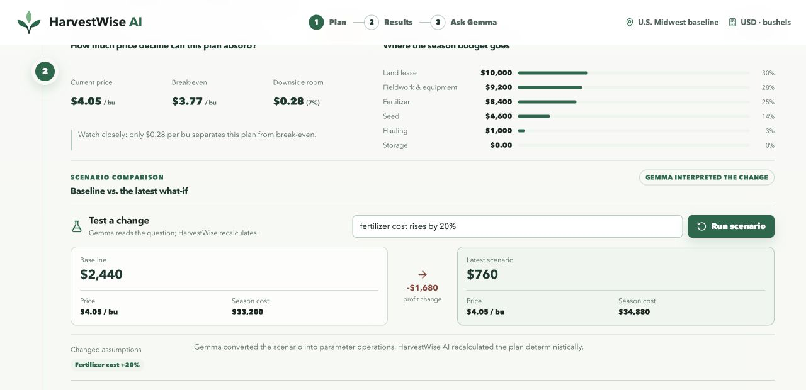
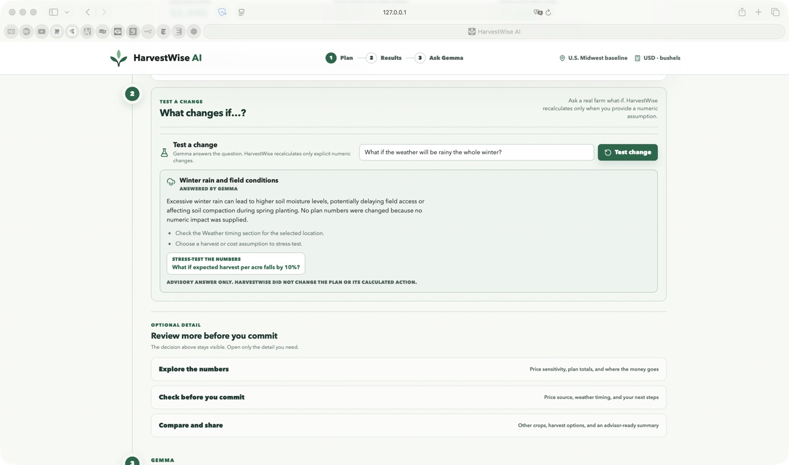
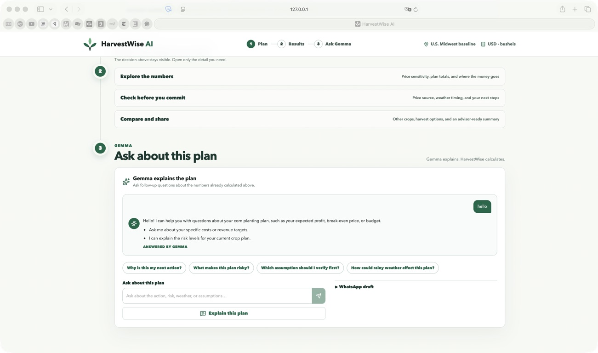

# HarvestWise AI

HarvestWise AI is a Gemma-powered farm profit planner for independent U.S. Midwest grain farmers and cooperative or extension advisors.

The app helps answer a practical question before a farmer spends money:

> What should I do next?

It keeps financial calculations deterministic in TypeScript, then uses Gemma to explain the plan in simple, farmer-friendly language.

## Current Status

The production demo is built around a guided farmer flow, deterministic finance, and a server-side Gemma explanation layer. It is designed for a hackathon demo and a future farmer pilot, not yet as a production farm-management system.

Production demo: [harvestwise-ai.vercel.app](https://harvestwise-ai.vercel.app)

## What It Does

- Builds a farm season budget from crop, land, input cost, harvest, and market price assumptions.
- Opens with an empty personal plan: results remain hidden until the farmer enters the four required numbers and creates the plan.
- Calculates expected profit, total cost, break-even price, ROI, budget gap, and risk level.
- Shows one deterministic **Recommended next action** with two concrete reasons: plant, reduce acreage, secure a buyer, wait, or store only above a calculated price.
- Uses a U.S. Midwest baseline with corn, soybeans, and wheat; money is USD and field-crop yields are bushels per acre.
- Includes land lease as a separate cost so a plan does not overstate profitability by omitting access to the field.
- Compares market decisions: sell at harvest, store short-term, or store longer.
- Generates a direct, question-aware explanation and WhatsApp draft through a server-side Gemma endpoint.
- Supports greetings, follow-up questions, and practical weather or risk questions with recent conversation context, while keeping every financial decision deterministic.
- Extracts a farm plan from natural language through the farm interview copilot.
- Converts numeric what-if questions into typed scenario operations, then recalculates with deterministic code.
- Answers qualitative what-if questions, such as a rainy winter, with clearly labelled advisory guidance and a suggested numeric stress test without silently changing the plan.
- Lets the farmer record where an entered market price came from: buyer, co-op, elevator, or another local source, plus location and confirmation date. The record has a freshness label and never changes the calculation.
- Can load an explicitly requested NWS forecast and active alerts for a farmer-selected Midwest location; it creates a timing prompt only and never changes finance or the recommended action.
- Creates a field-ready **Decision Pack** from the current plan: the calculated action, key financial limits, local checks, latest scenario, and clearly labelled price-evidence/NWS context. It can be copied into a co-op note or printed/saved as a PDF.
- Falls back to question-aware local advice if the model is unavailable or returns malformed output, so the demo remains useful instead of showing a generic report.
- Keeps the farmer journey focused: core assumptions, one recommended action, and a compact plan snapshot. Scenario testing, crop comparison, price sensitivity, and market options are available on demand.

## Tech Stack

- React + TypeScript + Vite
- Express API server
- Vercel serverless API entrypoints in `api`
- Vitest for domain tests
- `@google/genai` for Gemma/Gemini API access
- Clean domain/UI separation for scaling

## Run Locally

```bash
npm install
npm run dev
```

Open the Vite URL printed in the terminal, usually `http://localhost:5173`.

## Demo Path

Recommended 60-75 second judge flow:

1. Enter the prepared Corn example: `40 acres`, `$35,000` budget, `220 bu/acre`, and `$4.05/bu`.
2. Create the plan and show **Plant this plan**, expected profit of `$2,440`, and the entered-cost break-even of `$3.77/bu`.
3. Open **Test a change** and ask `fertilizer cost rises by 20%`.
4. Show `Gemma interpreted the change` and the deterministic comparison `$2,440 -> $760`.
5. Show that the original plan remains unchanged and open the **Field-ready decision pack**.
6. Explain the boundary in one sentence: Gemma converts farmer language into structured inputs; HarvestWise calculates every financial number and action.
7. Optionally ask the Advisor `hello` or a practical weather question to show a direct answer. A clearly labelled local fallback is never presented as Gemma output.

## U.S. Baseline and price evidence

The current product defaults are Midwest grain benchmarks, not live cash bids. They are deliberately editable and include seed, fertilizer, fieldwork/equipment, land lease, hauling, expected yield, and market price. See [U.S. baseline notes](docs/us-baseline.md) for sources and limits.

HarvestWise does not fetch or apply a remote price quote by default. Record a buyer, co-op, elevator, or other local source next to the entered price so the plan can be checked later without implying that the number is live market data.

### Live Gemma Evidence

The production flow visibly separates model work from deterministic finance:



Qualitative scenario and direct Advisor evidence:





Judge narration:

> Gemma turns farmer language into structured inputs and scenario operations. HarvestWise then recalculates every financial number and selects the recommended action in deterministic TypeScript.

## External benchmark

The demo is directionally compared with the University of Illinois Extension's 2026 Central Illinois corn budget in [U.S. baseline notes](docs/us-baseline.md#external-benchmark--directional-not-like-for-like). The comparison is intentionally not presented as validation: HarvestWise models only the cost categories entered in the app, while the Illinois budget includes broader economic costs and an estimated government payment.

## Limitations

- HarvestWise is a planning prototype, not agronomic, legal, investment, or financial advice.
- Market price is entered and evidenced by the farmer; it is not a live quote fetched by the app.
- The simplified model excludes crop insurance, debt service, taxes, complete machinery and overhead costs, and government payments.
- The displayed break-even is an **entered-cost break-even**, not a complete economic break-even.
- Risk bands are planning heuristics and have not been externally calibrated on farm outcomes.
- The current demo covers three Midwest grain crops and a small set of optional NWS locations.
- Model-provider failures return an honestly labelled local fallback so the deterministic plan remains usable.
- When live Gemma is used, the submitted note or question and relevant plan context are sent to the configured Google GenAI service; sensitive personal or financial identifiers should not be entered.
- Farmer or advisor interviews are still needed before claiming real-world validation.

## Submission references

- [Production demo](https://harvestwise-ai.vercel.app)
- [Final submission write-up](docs/submission-brief.md)
- [U.S. baseline, sources, and external benchmark](docs/us-baseline.md)
- [MIT license](LICENSE)

## Optional Gemma Setup

Create `.env` from `.env.example` and set:

```bash
GEMINI_API_KEY=your_key_here
GEMMA_MODEL=gemma-4-26b-a4b-it
```

Without a key, HarvestWise AI uses a local deterministic explanation fallback.

## Quality Checks

```bash
npm test
npm run typecheck
npm run build
```

## Project Shape

- `src/domain` contains pure agriculture-finance calculations.
- `src/features` contains product feature UI.
- `src/components` contains shared layout and UI primitives.
- `src/services` contains client API calls.
- `server` contains the Gemma advice endpoint.
- `server/gemmaStructured.ts` contains the structured Gemma integration for farm interviews and scenarios.
- `api` contains Vercel-compatible API entrypoints for advice, interview extraction, scenarios, and health checks.
- `public/favicon.svg` contains the final HarvestWise AI mark.
- `assets/concepts` contains the generated UI concept used as the visual reference.
- `docs/demo-polish-journal.md` tracks demo-readiness issues and completed polish work.

## Session Context

Read [HANDOFF.md](HANDOFF.md) first when continuing this project in a new Codex session.

## AI Boundary

Gemma is intentionally not used for financial math.

- Gemma extracts fields from natural language.
- Gemma maps scenario questions to parameter operations.
- Gemma explains deterministic results and can return advisory-only guidance for qualitative questions.
- Gemma cannot calculate, replace, or reword the recommended action.
- Qualitative guidance never mutates finance; only explicit typed operations are applied to a scenario.
- `src/domain` applies patches, runs what-if operations, and calculates all finance outputs.
