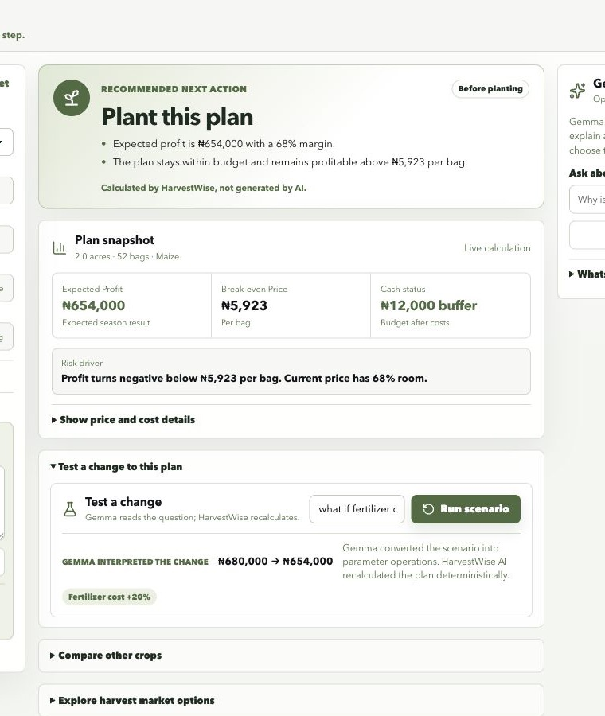

# HarvestWise AI

HarvestWise AI is a Gemma-powered farm profit planner for smallholder farmers and cooperative advisors.

The app helps answer a practical question before a farmer spends money:

> What should I do next?

It keeps financial calculations deterministic in TypeScript, then uses Gemma to explain the plan in simple, farmer-friendly language.

## Current Status

The deterministic farmer-action layer, simplified judge flow, Gemma output schemas, and updated demo documentation are now merged into `main`.

Latest pushed main commit:

```bash
71ce104 Add deterministic farmer actions
```

Production demo: [harvestwise-ai.vercel.app](https://harvestwise-ai.vercel.app)

## What It Does

- Builds a farm season budget from crop, land, input cost, harvest, and market price assumptions.
- Calculates expected profit, total cost, break-even price, ROI, budget gap, and risk level.
- Shows one deterministic **Recommended next action** with two concrete reasons: plant, reduce acreage, secure a buyer, wait, or store only above a calculated price.
- Compares crop options such as maize, cassava, rice, tomato, and beans.
- Compares market decisions: sell at harvest, store short-term, or store longer.
- Generates a plain-language explanation and WhatsApp draft through a server-side Gemma endpoint.
- Extracts a farm plan from natural language through the farm interview copilot.
- Converts what-if questions into scenario parameter changes, then recalculates with deterministic code.
- Falls back to local advice if no API key is configured, so the demo remains usable.
- Keeps the farmer journey focused: core assumptions, one recommended action, and a compact plan snapshot. Scenario testing, crop comparison, price sensitivity, and market options are available on demand.

## Tech Stack

- React + TypeScript + Vite
- Express API server
- Vercel serverless API entrypoints in `api`
- Vitest for domain tests
- `@google/genai` for Gemma/Gemini API access
- Clean domain/UI separation for scaling

## Run Locally

```bash
npm install
npm run dev
```

Open the Vite URL printed in the terminal, usually `http://localhost:5173`.

## Demo Path

Recommended 60-90 second judge flow:

1. Start on the dashboard and point to **Recommended next action** and its two calculated reasons.
2. Change the market price or available budget to show the action update deterministically.
3. Open **Test a change to this plan** and ask `what if fertilizer cost rises by 20%?`.
4. Open price, crop, or market details only if the judge wants to investigate the calculation.
5. Open **Gemma explains the plan** to demonstrate that AI explains or structures input, while HarvestWise keeps the decision deterministic.

### Live Gemma Evidence

The production flow visibly separates model work from deterministic finance:



Judge narration:

> Gemma turns farmer language into structured inputs and scenario operations. HarvestWise then recalculates every financial number and selects the recommended action in deterministic TypeScript.

## Optional Gemma Setup

Create `.env` from `.env.example` and set:

```bash
GEMINI_API_KEY=your_key_here
GEMMA_MODEL=gemma-4-26b-a4b-it
```

Without a key, HarvestWise AI uses a local deterministic explanation fallback.

## Quality Checks

```bash
npm test
npm run build
```

## Project Shape

- `src/domain` contains pure agriculture-finance calculations.
- `src/features` contains product feature UI.
- `src/components` contains shared layout and UI primitives.
- `src/services` contains client API calls.
- `server` contains the Gemma advice endpoint.
- `server/gemmaStructured.ts` contains the structured Gemma integration for farm interviews and scenarios.
- `api` contains Vercel-compatible API entrypoints for advice, interview extraction, scenarios, and health checks.
- `public/favicon.svg` contains the final HarvestWise AI mark.
- `assets/concepts` contains the generated UI concept used as the visual reference.
- `docs/demo-polish-journal.md` tracks demo-readiness issues and completed polish work.

## Session Context

Read `CONTEXT.md` first when continuing this project in a new Codex session.

## AI Boundary

Gemma is intentionally not used for financial math.

- Gemma extracts fields from natural language.
- Gemma maps scenario questions to parameter operations.
- Gemma explains deterministic results.
- Gemma cannot calculate, replace, or reword the recommended action.
- `src/domain` applies patches, runs what-if operations, and calculates all finance outputs.
